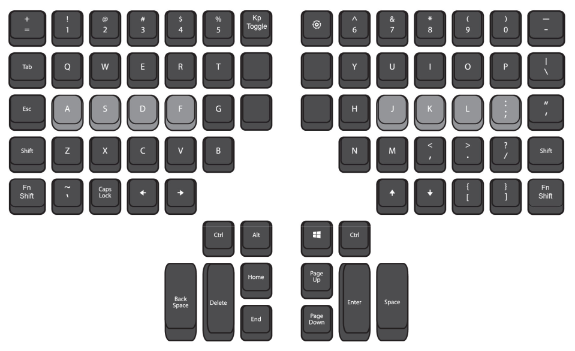

# ans_role_config_kinesis_adv360_smartset

Configure an attached Kinesis Advantage360 keyboard with custom keymaps.

[](https://github.com/digimokan/ans_role_config_kinesis_adv360_smartset/releases/latest "Latest Release Notes")
[](LICENSE.md "Project License")

## Table Of Contents

* [Purpose](#purpose)
* [Supported Operating Systems](#supported-operating-systems)
* [Requirements](#requirements)
* [Quick Start](#quick-start)
    * [Use From Playbook](#use-from-playbook)
* [Role Options](#role-options)
* [Programming Notes](#programming-notes)
    * [Default Key Locations](#default-key-locations)
    * [Types Of Keymaps](#types-of-keymaps)
    * [Commonly Remapped Key Names](#commonly-remapped-key-names)
* [Contributing](#contributing)

## Purpose

* Provide a [utility script](../templates/utility_script.j2) to configure an
  attached [Kinesis Advantage360 Keyboard](https://kinesis-ergo.com/support/kb360/)
  keyboard with custom keymaps.

## Supported Operating Systems

* Ubuntu
* Arch Linux
* FreeBSD

## Requirements

* The Advantage360 keyboard is a non-"pro" variant, which uses SmartSet
  programming, not the newer ZMK programming.
* The Advantage360 keyboard is attached to the system, via USB or Bluetooth.
* The keyboard's v-Drive has been exposed as a USB device, via pressing the
  _Smartset_ + _v-Drive_ keys.

## Quick Start

### Use From Playbook

1. Create `requirements.yml` in ansible project root, and add this content:

   ```yaml
   # requirements.yml
   - src: https://github.com/digimokan/ans_role_config_kinesis_adv360_smartset
   ```

2. From the project root directory, install/download the role:

   ```shell
   $ ansible-galaxy install --role-file requirements.yml --roles-path ./roles --force-with-deps
   ```

   * _NOTE:_ `--force-with-deps` _ensures subsequent calls download updates_

3. Include the role like any local role, from the project playbook:

   ```yaml
   # playbook.yml
   - hosts: localhost
     connection: local
     tasks:
       - name: "Configure an attached Kinesis Advantage360 keyboard with custom keymaps"
         ansible.builtin.include_role:
           name: ans_role_config_kinesis_adv360_smartset
   ```

## Role Options

Vars defined by this role, exported with `public: true`, for use in other roles:

  * [export](../defaults/main/export/commands.yml)

## Programming Notes

### Default Key Locations

The following default keys must be specified on the left side of all remaps.



### Types Of Keymaps

Simple 1:1 key remap:

```
[hk1]>[home]
```

Macro remap of left shift key to produce an underscore:

```
{lshf}>{-rshf}{hyph}{+rshf}
```

Macro remap with speed setting (set `s1` to `s9`):

```
{lctr}{hk4}>{s5}{b}{a}{s}{h}
```

Macro remap played `x` number of times (default plays continuously on key down).
Note: this can fix macros that inadvertently fire too many times:

```
{hk1}>{x3}{vol+)
```

Macro remap with delays between keys (set `d001` to `d999` in millisec):

```
{lctr}{hk4}>{b}{d300}{a}{d600}{s}{d900}{h}
```

Key remap for CAPSLOCK on tap, ALT when pressed more than 0.5 sec:

```
[lalt]>[caps][t&h500][lalt]
```

### Commonly Remapped Key Names

| Key    | Description         |
| :---   | :---                |
| _1_    | `1` and `!`         |
| _2_    | `2` and `@`         |
| _3_    | `3` and `#`         |
| _4_    | `4` and `$`         |
| _5_    | `5` and `%`         |
| _6_    | `6` and `^`         |
| _7_    | `7` and `&`         |
| _8_    | `8` and `*`         |
| _9_    | `9` and `(`         |
| _0_    | `0` and `)`         |
| _hyph_ | `-` and `_`         |
| _eql_  | `=` and `+`         |
| _obrk_ | `[` and `{`         |
| _cbrk_ | `]` and `}`         |
| _comm_ | `,` and `<`         |
| _perd_ | `.` and `>`         |
| _fsls_ | `/` and `?`         |
| _bsls_ | `\` and `|`         |
| _apos_ | `‘` and `“`         |
| _scol_ | `;` and `:`         |
| _grav_ | Grave and `~`       |
| _caps_ | Caps Lock           |
| _tab_  | Tab                 |
| _spc_  | Spacebar            |
| _ent_  | Return              |
| _del_  | Delete              |
| _esc_  | Escape              |
| _bspc_ | Delete              |
| _home_ | Home                |
| _end_  | End                 |
| _pgup_ | Page Up             |
| _pgdn_ | Page Down           |
| _left_ | Left Arrow          |
| _down_ | Down Arrow          |
| _paus_ | Pause               |
| _ins_  | Insert              |
| _sclk_ | Scroll Lock         |
| _prnt_ | Print Screen        |
| _rght_ | Right Arrow         |
| _up_   | Up Arrow            |
| _nmlk_ | Num Lock            |
| _mute_ | Mute                |
| _vol+_ | Volume Up           |
| _vol-_ | Volume Down         |
| _plpa_ | Play / Pause        |
| _lshf_ | Left Shift          |
| _rshf_ | Right Shift         |
| _lctr_ | Left Control        |
| _rctr_ | Right Control       |
| _lalt_ | Left Alt            |
| _ralt_ | Right Alt           |
| _lwin_ | Left Gui            |
| _rwin_ | Right Gui           |
| _keys_ | Keypad Layer Shift  |
| _keyt_ | Keypad Layer Toggle |
| _fn1s_ | FN1 Layer Shift     |
| _fn1t_ | FN1 Layer Toggle    |
| _fn2s_ | FN2 Layer Shift     |
| _fn2t_ | FN2 Layer Toggle    |
| _fn3s_ | FN3 Layer Shift     |
| _fn3t_ | FN3 Layer Toggle    |
| _hk1_  | Hotkey 1            |
| _hk2_  | Hotkey 2            |
| _hk3_  | Hotkey 3            |
| _hk4_  | Hotkey 4            |

## Contributing

* Feel free to report a bug or propose a feature by opening a new
  [Issue](https://github.com/digimokan/ans_role_config_kinesis_adv360_smartset/issues).
* Follow the project's [Contributing](CONTRIBUTING.md) guidelines.
* Respect the project's [Code Of Conduct](CODE_OF_CONDUCT.md).

